<p align="center">
  <picture>
    <source media="(prefers-color-scheme: dark)" srcset="docs/assets/logo-dark.svg">
    
  </picture>
</p>

Shared, persistent memory and a visible crew of tmux workers for Claude Code and Codex sessions on one project.

- Visible workers: each one is a real tmux pane you can read and type into.
- Exact state: workers report it through their own CLI's hooks, so nothing polls.
- One local SQLite store: no daemon, and nothing leaves your machine.



## Install

Requirements: macOS, Node `^22.14.0 || >=23.6.0`, [Claude Code](https://claude.com/claude-code), and tmux for the agent tools. codex is optional, only needed if a project opts a worker into it; see [docs/install.md](docs/install.md#codex-workers).

```bash
git clone https://github.com/cmgmyr/hive.git hive && cd hive
npm install
npm run build
npm link             # puts the hive command on your PATH
hive setup           # pins that command to one interpreter
brew install tmux
claude mcp add --scope user hive -- "$(command -v node)" "$(pwd)/dist/index.js"
ln -s "$(pwd)/claude-plugin" ~/.claude/skills/hive   # optional: session-start kickoff
hive doctor          # verify: node, ABI, tmux, claude, database, hooks all green
```

Put `~/.local/bin` on your PATH below your version manager's block. See [Node version and the interpreter pin](docs/install.md#node-version-and-the-interpreter-pin) for why the order matters.

## First run

Run `cd ~/Code/your-project && hive`. It is shorthand for `hive lead`, and it opens a `lead` window running Claude in this project's tmux session, with the lead session named after the project so your other Claude Code sessions can address it by that name; ask it to triage, and it reads the standing process and proposes work. Spawn workers with `agent_spawn`, and watch or take over any of them with `tmux -CC attach -t hive-main` (or plain `tmux attach`).

## How it works

Each Claude Code session runs its own `hive` MCP server over stdio, and every instance reads and writes one SQLite database (WAL mode) at `~/.hive/hive.db`, so every session sees the same state. There is no daemon and nothing leaves your machine. State is scoped to a project (a directory), resolved from the working directory; a lead spawns workers into tmux panes locked to that project.

## Why not subagents?

| | Subagents | hive workers |
|---|---|---|
| Visibility | report at the end | live terminal you read and type into |
| Persistence | vanish with the conversation | pads and todos outlive every session |
| Lifetime | die with the parent | keep running when the lead detaches |
| Scope | one session | several sessions, terminals, humans |

Hive workers can still use subagents. See [Why not subagents?](docs/concepts.md#why-not-subagents) for the longer answer.

## Status

hive is a personal daily-driver tool, released low-key. It is single-user by design and dogfooded daily by its author on macOS. The test suite also runs on Linux in CI, but nobody drives hive there yet. Issues are welcome; for bigger changes, open a discussion first. See [CONTRIBUTING.md](CONTRIBUTING.md). MIT licensed.

## Docs

| Page | What's there |
|---|---|
| [Architecture](docs/architecture.md) | Seven diagrams: process topology, module layering, spawn sequence, wake lifecycle, worker state, project scoping, store and server identity |
| [Patterns](docs/patterns.md) | Standing trades, refused approaches, evidence standards, and guard shapes distilled from the project's own decisions and dead-ends |
| [Concepts](docs/concepts.md) | Vocabulary, why not subagents, identity, the workflow, project scope, the shared store |
| [Daily driver](docs/daily-driver.md) | A day with hive, starting a session, watching workers, wake-ups |
| [Commands](docs/commands.md) | Every `hive` subcommand and what it does |
| [Configuration](docs/configuration.md) | The `HIVE_*` environment variables |
| [Profiles](docs/profiles.md) | Standing instructions across projects, the session-start plugin |
| [Projects](docs/projects.md) | `hive init`, `hive.yml`, automatic backups, pads and todos from the shell |
| [Install details](docs/install.md) | The interpreter pin, iTerm settings, the status line, MCP scope, codex workers, updating, uninstalling |
| [Troubleshooting](docs/troubleshooting.md) | Common errors and their fixes |
| [Tools](docs/tools.md) | The 45 MCP tools: what each does and when to use it |
| [tmux settings](docs/tmux.md) | Attach modes, pane options, and what to put in `~/.tmux.conf` |
| [Development](docs/development.md) | Building and testing hive itself |
