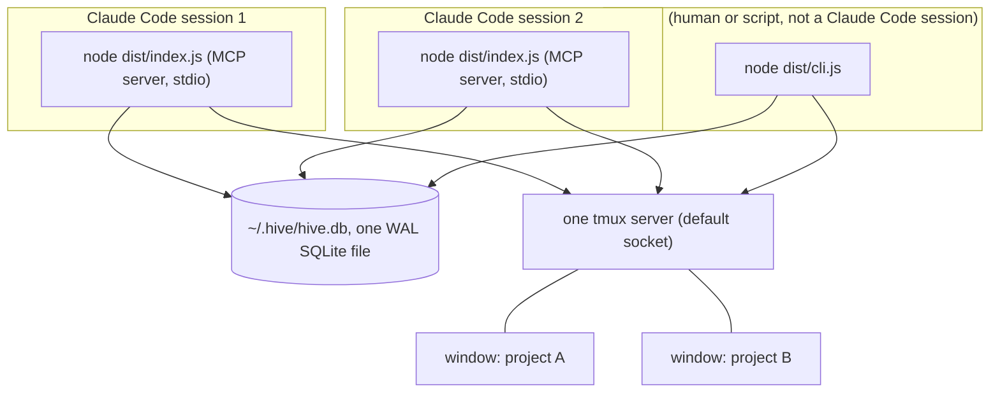
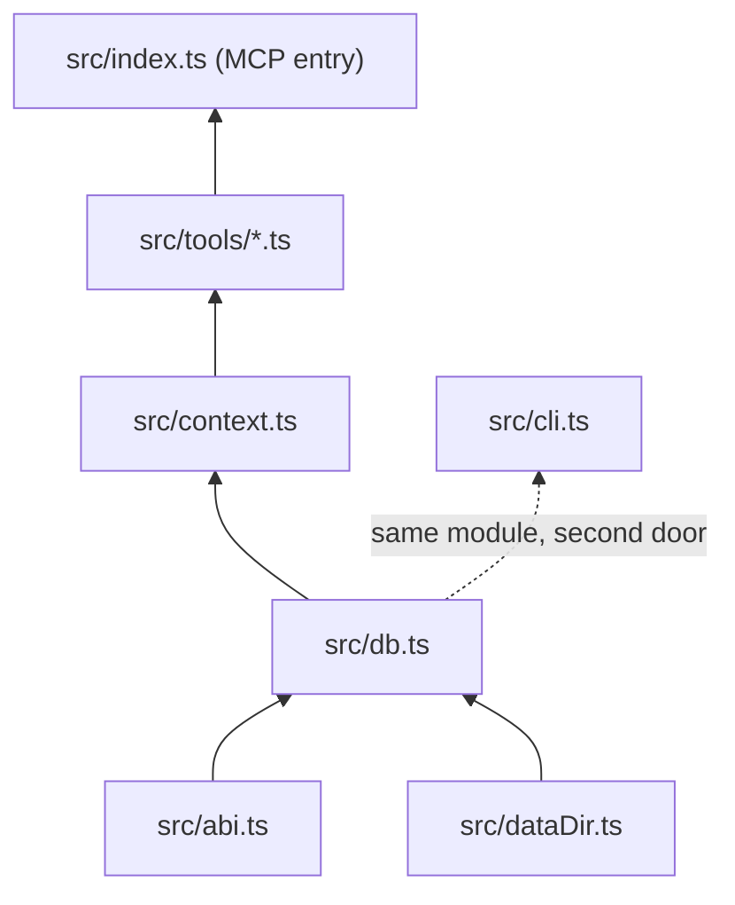
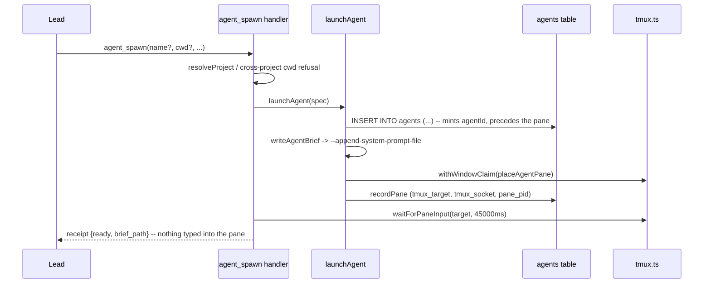
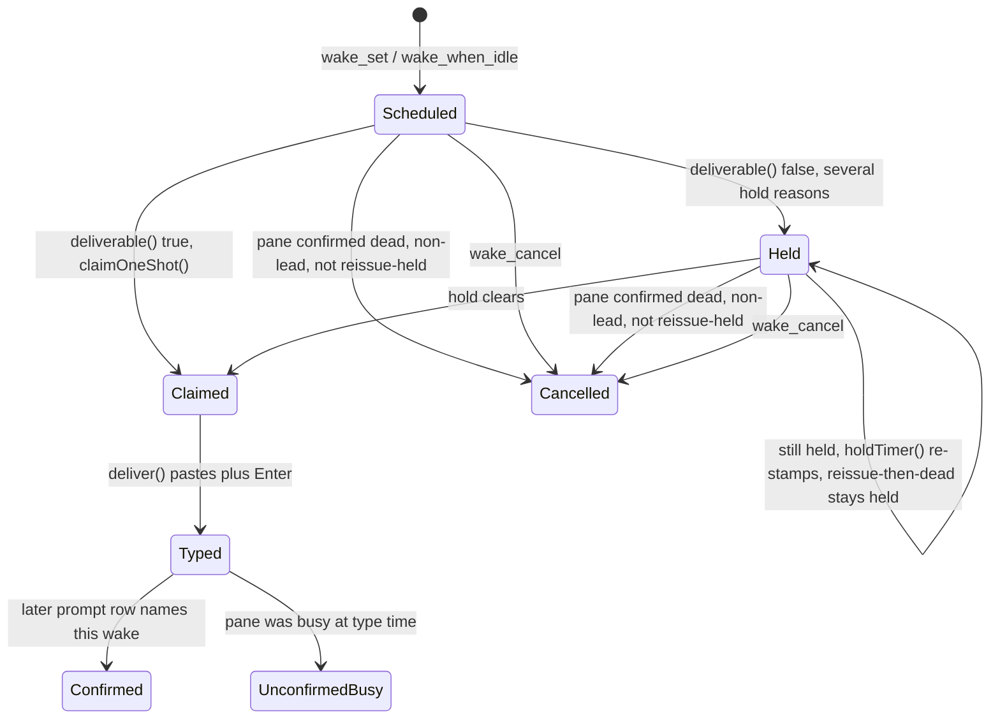
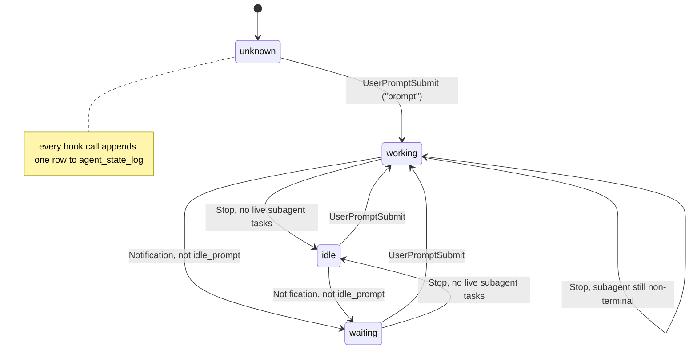
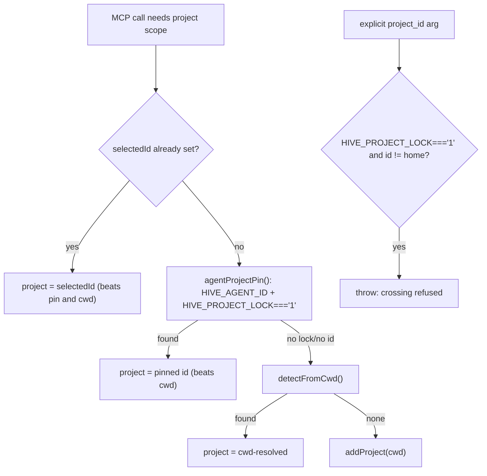
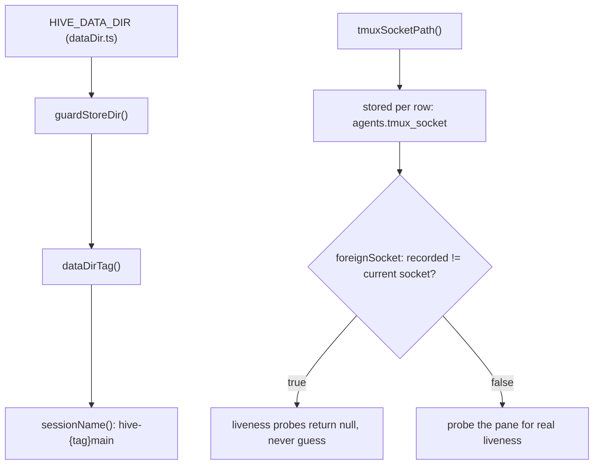

# Architecture

Seven diagrams for a reader who has to reason about a change, not perform a task. `README.md` covers install and daily use. `CLAUDE.md` states the invariants that must never break. `.claude/rules/*.md` explains why one specific guard exists, and fires automatically when you open the file it guards. None of the three gives you the shape of the whole system before you decide where a change belongs, and that gap is what this document fills.

This document is not setup instructions, not the invariant list, and not per-guard reasoning. It links to a rule rather than restating it: the rule is the authority, and a second copy of its reasoning is a second copy that can drift. Where the `hive-internals` skill holds the evidence behind a rule, this document links to that reference too rather than restating its measurement. Read a rule or a reference when you need the why; read this when you need the shape.

Every mechanical claim here cites `file:line`. A diagram is a claim that reads as settled, so an unverified one is worse than no diagram: each of the seven below was checked against the current source, not against a rule's description of it, and two places where a live description had drifted from the code are called out inline. Some claims describe an observed behavior rather than an invariant enforced in code; those state the date and Claude Code build they were measured against, because that kind of claim is only as current as its last measurement.

## 1. Process topology

The thing newcomers get wrong first: hive has no daemon and nothing leaves the machine. Every Claude Code session runs its own `hive` MCP server (`McpServer`/`StdioServerTransport`, `src/index.ts:2-11`) as a plain child process talking JSON-RPC over stdio, and every one of those processes, plus the `hive` CLI, opens the same WAL-mode SQLite file directly (`new Database`, `src/db.ts:4-5,9,16,18,42`; `src/cli.ts:50` imports `db`, `dataDir`, and `migrate` from that same module, a different door onto the same store). Coordination beyond the database goes through one shared tmux server: one session per store, one window per project inside it (`.claude/rules/tmux-and-panes.md`).

## 2. Module layering

`abi` and `dataDir` sit under `db`, because opening the database needs both an addon that loads and a directory it is allowed to open: `src/db.ts:4` imports `guardAbi`, called at `:16` immediately before `new Database(...)` at `:18`, and `src/db.ts:5` imports `guardStoreDir`, called at `:9` first to determine where that database lives. `context` and every tool in `src/tools/*.ts` import `db` directly and sit above it. `src/cli.ts:50` imports `dataDir`, `db`, and `migrate` directly from the same module the MCP entry point uses; it is the store's second door, not a caller of the tool layer.

## 3. Spawn sequence

`agent_spawn` resolves the target project and refuses a `cwd` whose own project (`cwdProject`) is different from and already registered before the one being spawned into (`resolveProject`, `src/tools/agents.ts:498-516`). `launchAgent` (`src/spawn.ts:182-245`) then does something specific on purpose: it `INSERT`s the `agents` row (`:194-207`) and mints `agentId` from the insert's row id (`:212`) *before* a pane exists. The row exists first because the worker's brief needs `agentId` and `actorId` to write itself (`buildCommand`'s closure, `src/tools/agents.ts:541-556`, calling `writeAgentBrief`/`workerBrief`), and that brief path has to be ready before the pane that will read it is created. The brief reaches the worker's system prompt through `--append-system-prompt-file` (`src/harnesses.ts:52`, the claude harness's own `briefDelivery`), not through anything typed into the pane. `placeAgentPane` creates the pane only after that, claiming the shared tmux window internally via `withWindowClaim` (`src/spawn.ts:232`), and `recordPane` stores its target and socket (`:235`). Back in the tool handler, `waitForPaneInput` polls for the worker's prompt box before the receipt returns (`src/tools/agents.ts:583`; `src/tmux.ts:997-1017`).

**A stale claim this diagram corrects rather than repeats:** nothing is typed into a spawned worker's pane. That behavior was removed by commit `5cdf71b` (todo 387, 2026-08-13); the receipt field is `ready`, not `announced`. Three live strings described the old behavior until this branch's third commit corrected them, a separate, lane-adjacent fix: `agent_spawn`'s tool description (`src/tools/agents.ts:453`, which still correctly says the worker is `briefed automatically`) used to also say the worker spawns in a tmux window, contradicting its own `placement` default of a pane in the lead's window, and that a short hive line is typed into its pane as the visible first turn; two spots in `src/help.ts:74-77,143-145` (which still correctly say a worker `briefs itself`) repeated the same typed-line claim.

## 4. Wake lifecycle

The transition people get wrong is the one with no arrow drawn on the obvious version of this diagram: a held wake does not always return to scheduled. `deliverable()` (`src/scheduler.ts:1744-1818`) holds a timer for several reasons, drawn from ten `HELD_REASON_*` constants (`:586-628`, starting at `HELD_REASON_MODAL_CHOICE`) covering six categories — a modal choice, unsubmitted human text in the input box, the lead's own pane gone, a pane id that was reissued, a pane that could not be read at all (todo 507; transient, so it retries on the next tick), or a pane whose harness hive cannot classify (todo 507; nothing hive does on its own lifts this one - only replacing that pane with one hive starts itself) — plus an eleventh constant, `HELD_REASON_CONVERSATION` (`:639-642`), for a seventh category: a lead-bound wake landing while a human recently talked to that lead (todo 455). `holdTimer` re-stamps `held_at` on every tick the condition still applies (`:574-584`). If the target pane is confirmed dead outright, and it is not the lead's pane, and it was not already held for a reissue, `cancelTimer` cancels the timer rather than holding it (`:1761`); a pane that was ALREADY held for a reissue and is then found dead stays held under `HELD_REASON_PANE_REISSUED_THEN_DEAD` rather than cancelling. `wake_cancel` can also cancel a wake directly from either `Scheduled` or `Held`.

Separately, a hold for a modal choice or unsubmitted input can tell the wake's owner about it, but only when the owner is a different actor from the wake's delivery target and has a live pane of its own (`ownerPaneToTell`, `:773-778`): `noteModalHold`/`noteUnsubmittedInputHold` insert a one-off notice with no parent timer (`insertNotice(..., null)`, `:790-804`), which `NOTICE_MAX_AGE` never applies to because `noticeDisposition` short-circuits on a missing parent (`:1668-1681`). That aging check exists for a different mechanism: the standing `wake_when_idle` watch's own coalesced notice carries a real parent timer and gets its `created_at` refreshed by `updateNoticeInPlace` each time the watch re-fires (`pendingNoticeFor`/`updateNoticeInPlace`, called from `claimStandingBatch`, `:1455,1487`), which is what actually ages out past one hour (`NOTICE_MAX_AGE`, `:1076`) once the watch goes quiet. Ageing one out does not destroy the finish silently: the cancel and a short replacement notice naming the workers it covered are one transaction (`ageOutNotice`, `:1731-1738`), and the replacement carries no parent, so it cannot age out in its turn (todo 465). A hold for a dead or reissued pane produces no notice at all; only the two reasons above reach `ownerPaneToTell`. The conversation hold (above) files no notice of its own, by design - see `.claude/sessions/dead-ends/2026-08-14-two-hold-reason-constants-to-make-a-claim-refusable.md`.

Once a wake clears its hold, `claimOneShot` is an atomic conditional `UPDATE` (`:1870-1878`) so two scheduler ticks can never both claim the same delivery. `deliver()` then pastes the body and sends Enter; the timers row records `typed_busy` when the pane was busy at type time (`:2138`). Confirmation is not something hive's SQL enforces, and this claim is only as current as its last measurement: on Claude Code 2.1.237 (2026-08-20), delivery into a busy pane was absorbed into the pane's running turn, produced no fresh `UserPromptSubmit`, and never confirmed. An earlier trial on Claude Code 2.1.231 observed the same kind of enqueue instead draining as a fresh turn that did confirm. Nobody has evidence for why the two disagree: a real behavior change, a timing shift, and a difference in how the two measurements were run are all still open. Method, trial counts, and why the 2.1.237 negative is bounded rather than settled: `.claude/skills/hive-internals/references/tmux-and-panes.md`.

## 5. Worker state

A Claude Code hook fires on exactly three events, `Stop`, `UserPromptSubmit`, and `Notification`, each mapped to one hive event name (`src/hooks.ts:22-23`, plus `Stop` at :21): `Stop` to `stop`, `UserPromptSubmit` to `prompt`, `Notification` to `notify`. `stateFor` (`src/hook.ts:85-97`) turns that into a state: `prompt` is always `working`; `stop` is `idle` unless a subagent task is still non-terminal (`waitingOnSubagents`, `:63-65,90-91`), in which case it stays `working`. A background shell or monitor deliberately does NOT withhold it, since neither need ever terminate, and the standing notice names those instead (`src/backgroundTasks.ts`, todo 468); `notify` becomes `waiting` via `stateForNotification` (`:67-75`), except an `idle_prompt` notification, which returns `null` and skips the `agents` row's own state update. That does not skip the log: `record()` runs unconditionally with `state ?? UNCHANGED` (`:121`), so an `idle_prompt` notification still appends a row to `agent_state_log`, with state `unchanged`. Every hook invocation appends exactly one row that way, keyed by `HIVE_AGENT_ID` (`.claude/rules/worker-state.md`).

## 6. Identity and project scoping

A call with no explicit `project_id` resolves through `resolveHomeProject` (`src/context.ts:254-271`), which first returns an already-cached `selectedId` if one is set (`:255`) — a `project_select` call or an earlier resolution in the same process beats both the pin and cwd. Failing that, it checks the pin before it checks the working directory: `agentProjectPin()` runs first (`:256`), and `detectFromCwd()` only runs if that returns `null` (`:261`). The pin only activates when `HIVE_AGENT_ID` is set and the guard `HIVE_PROJECT_LOCK !== "1"` is false (`:224`); it looks up the caller's `agents` row and returns that row's `project_id`, gated by `projectPathGuard` comparing it against `HIVE_PROJECT_PATH` (`:200-218,251`). An explicit `project_id` argument goes through `assertAccessible` instead, which refuses any id other than the home project once `HIVE_PROJECT_LOCK` is set (`:76-84`). `agent_spawn`'s call to `resolveProject` applies the same lock to a `cwd` that resolves to a different, already-registered project than the one being spawned into (`src/tools/agents.ts:498-516`), with the specific refusal shaped by whether the caller is locked at all.

Why a worker's files and its store are separate questions, and the accepted residuals of that split, are in `.claude/rules/project-scoping.md`.

## 7. Store and server identity

`HIVE_DATA_DIR` resolves to a `storeDir()` (`src/dataDir.ts:9,47-54`, guarded against the default store for a non-product entry point), and `dataDirTag()` derives a short hash of that directory for anything that has to stay unique per store (`:95-96`). The tmux session name is one of those things: `hive-{tag}main`, one session per store rather than one per project (`.claude/rules/tmux-and-panes.md`). A tmux socket path is computed at spawn or resume time (`tmuxSocketPath`, `src/tmux.ts:291`) and stored per agent row (`agents.tmux_socket`). Every later liveness check compares that recorded socket against the current one (`foreignSocket`, `:487`); when they differ, hive is looking at a row it cannot see into, and the answer is `null`, never a guess (`rowLive`, `:491-504`).

Why a socket path is a location and not a server identity, and why that is accepted rather than fixed, is in `.claude/rules/tmux-and-panes.md`.
