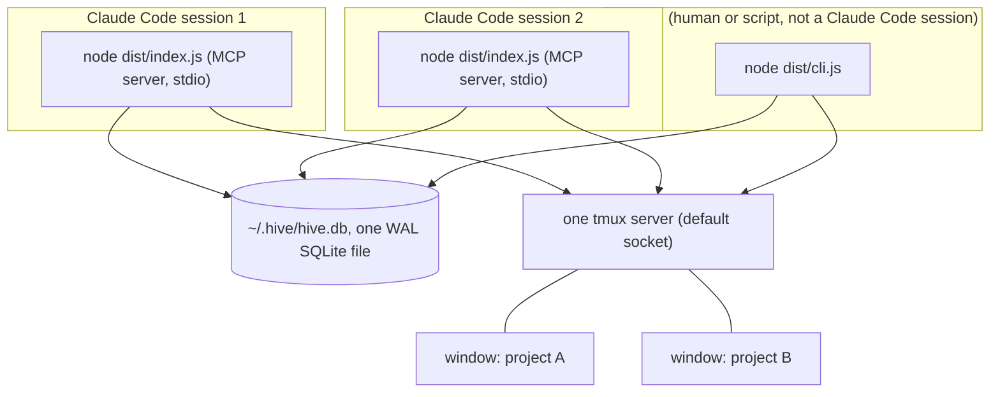
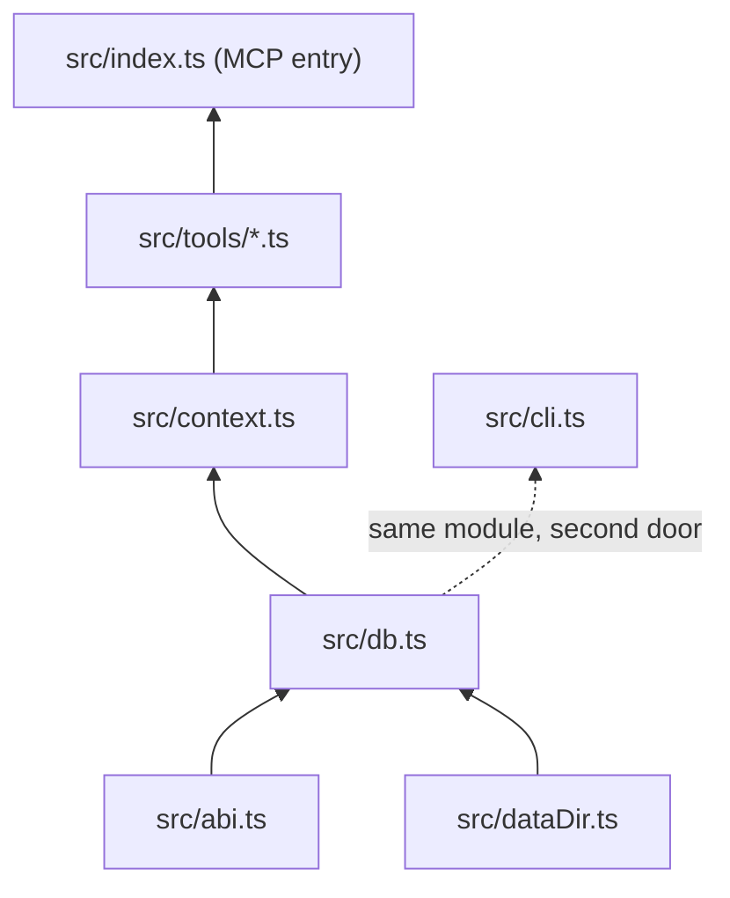
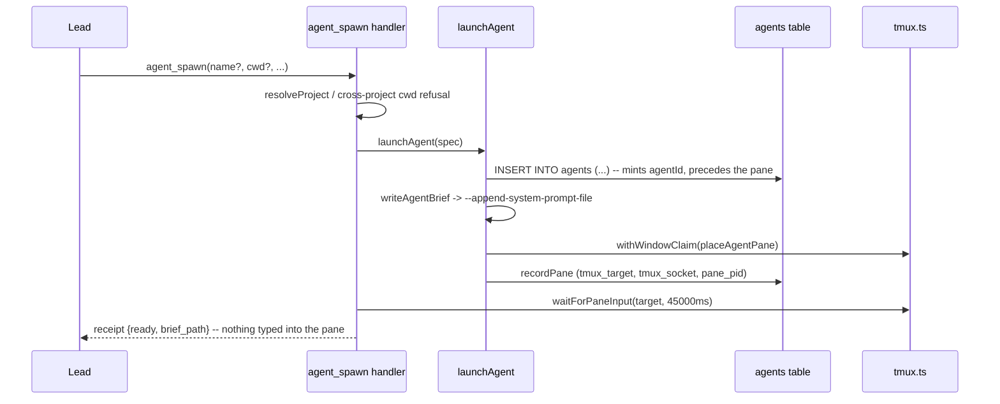
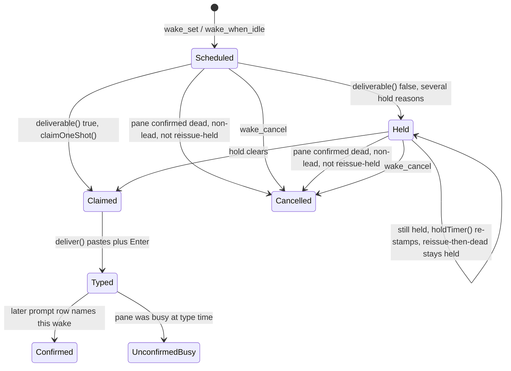
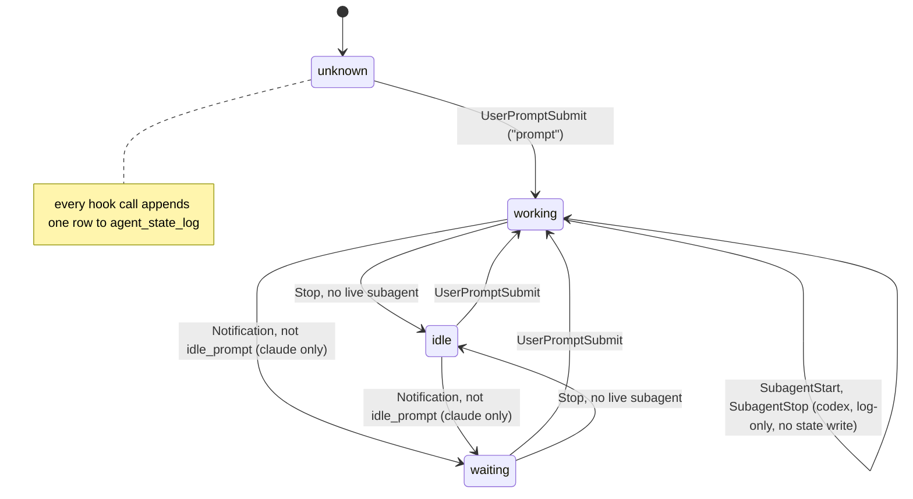
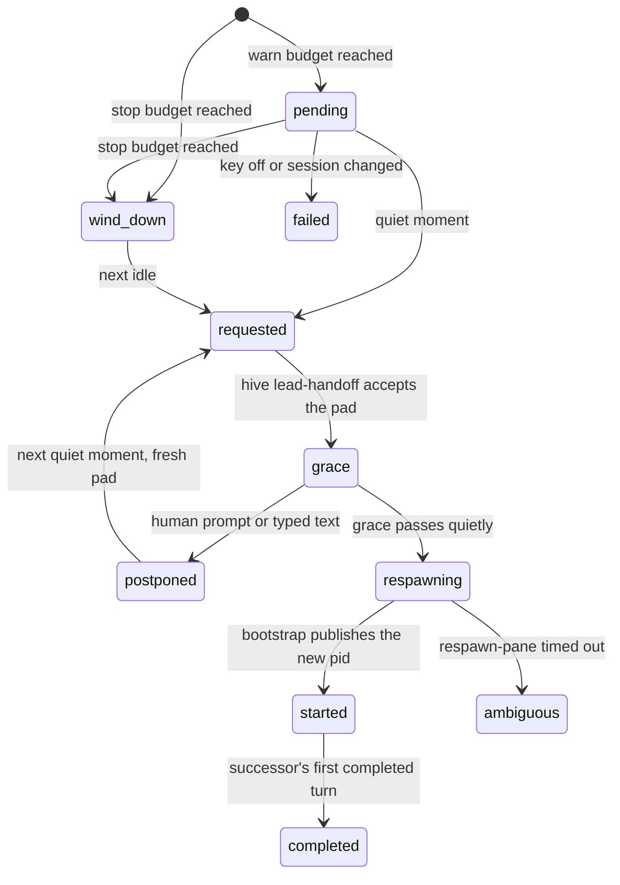
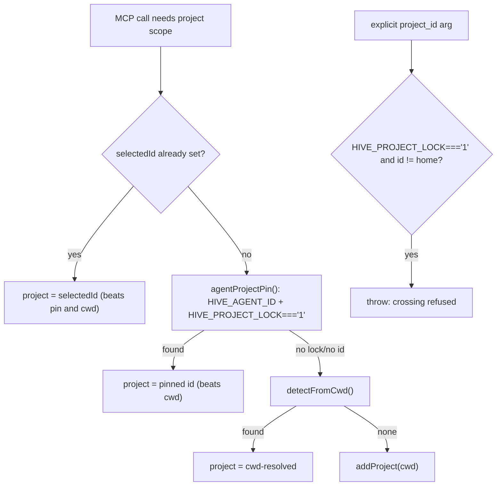
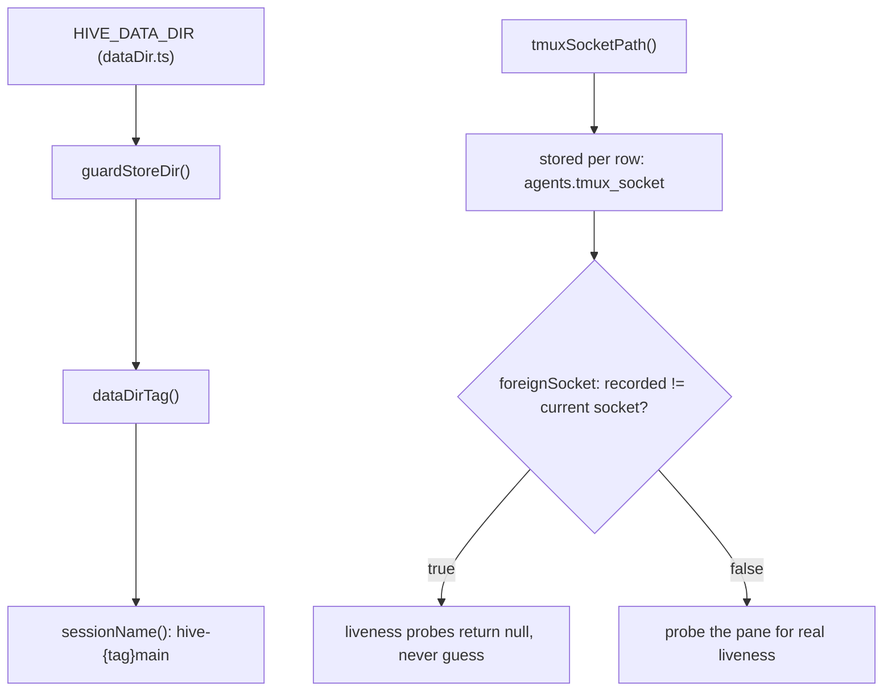

# Architecture

Seven diagrams for a reader who has to reason about a change, not perform a task. `README.md` and `docs/install.md` cover install, and `docs/daily-driver.md` covers daily use. `CLAUDE.md` states the invariants that must never break. `.claude/rules/*.md` explains why one specific guard exists, and fires automatically when you open the file it guards. None of the three gives you the shape of the whole system before you decide where a change belongs, and that gap is what this document fills.

This document is not setup instructions, not the invariant list, and not per-guard reasoning. It links to a rule rather than restating it: the rule is the authority, and a second copy of its reasoning is a second copy that can drift. Where the `hive-internals` skill holds the evidence behind a rule, this document links to that reference too rather than restating its measurement. Read a rule or a reference when you need the why; read this when you need the shape.

Every mechanical claim here cites `file:line`. A diagram is a claim that reads as settled, so an unverified one is worse than no diagram: each of the seven below was checked against the current source, not against a rule's description of it, and two places where a live description had drifted from the code are called out inline. Some claims describe an observed behavior rather than an invariant enforced in code; those state the date and Claude Code build they were measured against, because that kind of claim is only as current as its last measurement.

## 1. Process topology

The thing newcomers get wrong first: hive has no daemon. Every Claude Code session runs its own `hive` MCP server (`McpServer`/`StdioServerTransport`, `src/index.ts:2-11`) as a plain child process talking JSON-RPC over stdio, and every one of those processes, plus the `hive` CLI, opens the same WAL-mode SQLite file directly (`new Database`, `src/db.ts:4-5,9,16,18,42`; `src/cli.ts:57` imports `db`, `dataDir`, and `migrate` from that same module, a different door onto the same store). The CLI makes one npm registry request only for `hive --version --check`, `hive upgrade`, or an interactive doctor refresh; the MCP server, hooks, and scheduler never do, and `HIVE_NO_UPDATE_CHECK=1` disables it. Coordination beyond the database goes through one shared tmux server: one session per store, one window per project inside it (`.claude/rules/tmux-and-panes.md`).

```mermaid
flowchart TB
    subgraph S1["Claude Code session 1"]
      P1["node dist/index.js (MCP server, stdio)"]
    end
    subgraph S2["Claude Code session 2"]
      P2["node dist/index.js (MCP server, stdio)"]
    end
    subgraph SN["hive CLI (human or script, not a Claude Code session)"]
      P3["node dist/cli.js"]
    end
    P1 --> DB[("~/.hive/hive.db, one WAL SQLite file")]
    P2 --> DB
    P3 --> DB
    P1 --> TMUX["one tmux server (default socket)"]
    P2 --> TMUX
    P3 --> TMUX
    TMUX --- W1["window: project A"]
    TMUX --- W2["window: project B"]
```

## 2. Module layering

`abi` and `dataDir` sit under `db`, because opening the database needs both an addon that loads and a directory it is allowed to open: `src/db.ts:4` imports `guardAbi`, called at `:16` immediately before `new Database(...)` at `:18`, and `src/db.ts:5` imports `guardStoreDir`, called at `:9` first to determine where that database lives. `context` and every tool in `src/tools/*.ts` import `db` directly and sit above it. `src/cli.ts:57` imports `dataDir`, `db`, and `migrate` directly from the same module the MCP entry point uses; it is the store's second door, not a caller of the tool layer.

```mermaid
flowchart BT
    abi["src/abi.ts"] --> dbmod["src/db.ts"]
    dataDir["src/dataDir.ts"] --> dbmod
    dbmod --> context["src/context.ts"]
    context --> tools["src/tools/*.ts"]
    tools --> index["src/index.ts (MCP entry)"]
    dbmod -.->|"same module, second door"| clim["src/cli.ts"]
```

## 3. Spawn sequence

`agent_spawn` resolves the target project and refuses a `cwd` whose own project (`cwdProject`) is different from and already registered before the one being spawned into (`resolveProject`, `src/tools/agents.ts:688-706`). `launchAgent` (`src/spawn.ts:324-406`) then does something specific on purpose: it `INSERT`s the `agents` row (`:342-361`) and mints `agentId` from the insert's row id (`:366`) *before* a pane exists. The row exists first because the worker's brief needs `agentId` and `actorId` to write itself (`buildCommand`'s closure, `src/tools/agents.ts:780-802`, calling `writeAgentBrief`/`workerBrief`), and that brief path has to be ready before the pane that will read it is created. The brief reaches the worker's system prompt through `--append-system-prompt-file` (`src/harnesses.ts:134`, the claude harness's own `briefDelivery`), not through anything typed into the pane. `placeAgentPane` creates the pane only after that, claiming the shared tmux window internally via `withWindowClaim` (`src/spawn.ts:238-322`), and `recordPane` stores its target and socket (`:395`). Back in the tool handler, `pollPaneReadiness` polls for the worker's prompt box - or its process having already exited - before the receipt returns (`src/tools/agents.ts:851`; `src/tmux.ts:1590-1614`).

**A stale claim this diagram corrects rather than repeats:** nothing is typed into a spawned worker's pane. That behavior was removed by commit `5cdf71b` (2026-08-13); the receipt field is `ready`, not `announced`. Three live strings described the old behavior until this branch's third commit corrected them, a separate, lane-adjacent fix: `agent_spawn`'s tool description (`src/tools/agents.ts:615`, which still correctly says the worker is `briefed automatically`) used to also say the worker spawns in a tmux window, contradicting its own `placement` default of a pane in the lead's window, and that a short hive line is typed into its pane as the visible first turn; two spots in `src/help.ts:73-76,142-144` (which still correctly say a worker `briefs itself`) repeated the same typed-line claim.

```mermaid
sequenceDiagram
    participant Lead
    participant Tool as agent_spawn handler
    participant Spawn as launchAgent
    participant DB as agents table
    participant Tmux as tmux.ts
    Lead->>Tool: agent_spawn(name?, cwd?, ...)
    Tool->>Tool: resolveProject / cross-project cwd refusal
    Tool->>Spawn: launchAgent(spec)
    Spawn->>DB: INSERT INTO agents (...) -- mints agentId, precedes the pane
    Spawn->>Spawn: writeAgentBrief -> --append-system-prompt-file
    Spawn->>Tmux: withWindowClaim(placeAgentPane)
    Spawn->>DB: recordPane (tmux_target, tmux_socket, pane_pid)
    Tool->>Tmux: waitForPaneInput(target, 45000ms)
    Tool-->>Lead: receipt {ready, brief_path} -- nothing typed into the pane
```

## 4. Wake lifecycle

The transition people get wrong is the one with no arrow drawn on the obvious version of this diagram: a held wake does not always return to scheduled. `deliverable()` (`src/scheduler.ts:2177-2264`) holds a timer for several reasons, drawn from the `HELD_REASON_*` constants (`:887-976`, starting at `HELD_REASON_MODAL_CHOICE`): a modal choice, unsubmitted human text in the input box, the lead's own pane gone, a pane id that was reissued, a row whose pane ownership cannot be verified (no recorded pane pid, or the row records a different pane than the wake), a closed lead row waiting for `hive lead` to re-point it, a pane that could not be read at all (transient, so it retries on the next tick), a pane whose harness hive cannot classify (nothing hive does on its own lifts this one - only replacing that pane with one hive starts itself), and `HELD_REASON_CONVERSATION` (`:980-983`) for a lead-bound wake landing while a human recently talked to that lead. `holdTimer` re-stamps `held_at` on every tick the condition still applies (`:871-885`). If the target pane is confirmed dead outright, and it is not the lead's pane, and it was not already held for a reissue or unverifiable ownership, `cancelTimer` cancels the timer rather than holding it (`:2172`); a wake ALREADY held for either identity reason and then found dead stays held under its `_THEN_DEAD` reason rather than cancelling. A wake whose worker row is closed is cancelled with `HELD_REASON_ACTOR_CLOSED` (`:933-935`) and is never typed, and a wake whose row stops owning the pane between the claim and the Enter records `delivery stopped after claim` rather than being re-armed. `wake_cancel` can also cancel a wake directly from either `Scheduled` or `Held`.

Separately, a hold for a modal choice or unsubmitted input can tell the wake's owner about it, but only when the owner is a different actor from the wake's delivery target and has a live pane of its own (`ownerPaneToTell`, `:1116-1121`). `noteModalHold` and `noteUnsubmittedInputHold` both insert a notice parent-linked to the wake it is about (`insertNotice(..., timer.id)`, `:1210` and `:1256`), so cancelling that wake cascades to cancel a notice that would otherwise go on saying something about a wake that no longer exists. Neither can ever be AGED OUT by `NOTICE_MAX_AGE`, though, and that is deliberate: `noticeDisposition` (`:2045-2073`) only ages a FINISH-shaped notice - one holding a claim in `wake_idle_notices` - and a notice about a wake's own hold has no such claim, so the cascade and the age-out are independent consequences of the same parent link rather than a package deal. That independence is the point: a worker stuck on a dialog for an hour is more likely still stuck, not less, so ageing that notice out the way a finish ages out would be exactly backwards. The same function orphans a notice about a wake once that wake reaches ANY terminal state, not only cancellation: a one-shot parent that FIRED for good has nothing left to report either, though a repeating parent's `fired_at` is set on every cycle and is never terminal on its own. The standing `wake_when_idle` watch's own coalesced notice DOES claim `wake_idle_notices` rows and gets its `created_at` refreshed by `updateNoticeInPlace` each time the watch re-fires (`pendingNoticeFor`/`updateNoticeInPlace`, called from `claimStandingBatch`, `:1806,1842`), which is what actually ages out past one hour (`NOTICE_MAX_AGE`, `:1428`) once the watch goes quiet. Ageing one out does not destroy the finish silently: the cancel and a short replacement notice naming the workers it covered are one transaction (`ageOutNotice`, `:2126-2133`), and the replacement carries no parent, so it cannot age out in its turn. A hold for a dead or reissued pane produces no notice at all; only the two reasons above reach `ownerPaneToTell`. The conversation hold (above) files no notice of its own, by design: splitting the hold reason into reported and unreported variants only holds if every writer of that value is gated by the same predicate, and the fallback path was not.

Once a wake clears its hold, `claimOneShot` is an atomic conditional `UPDATE` (`:2356-2364`) so two scheduler ticks can never both claim the same delivery. `deliver()` then pastes the body and sends Enter; the wakes row records `typed_busy` when the pane was busy at type time (`:2915`). Confirmation is not something hive's SQL enforces, and this claim is only as current as its last measurement: on Claude Code 2.1.237 (2026-08-20), delivery into a busy pane was absorbed into the pane's running turn, produced no fresh `UserPromptSubmit`, and never confirmed. An earlier trial on Claude Code 2.1.231 observed the same kind of enqueue instead draining as a fresh turn that did confirm. Nobody has evidence for why the two disagree: a real behavior change, a timing shift, and a difference in how the two measurements were run are all still open. Method, trial counts, and why the 2.1.237 negative is bounded rather than settled: `.claude/skills/hive-internals/references/tmux-and-panes.md`.

With `quiet_messaging: true` (`docs/projects.md`), the last hop of a wake to a live Claude lead changes and nothing before it does: the same holds apply, the same claim fires it, and the same rendered text is sent. `socketRoute` (`src/scheduler.ts:2763`) admits only a row-owned lead whose `SessionStart` hook registered its socket from the current pane pid (`registerLeadMessagingSocket`, `src/hook.ts:228`). `postClaudeWake` (`src/claudeWake.ts:20`) writes one JSON line in a named-sender envelope, and the row records `delivery_method = 'socket'` and `socket_attempt_at`, never `typed_at`. `checkConfirmations` (`src/scheduler.ts:727`) confirms it from the prompt hook exactly as it does a typed wake, measured from `socket_attempt_at`. Every tick, `retryUnconfirmedSocketWakes` (`src/scheduler.ts:3002`) selects socket wakes still unconfirmed; `socketFallbackDue` (`src/scheduler.ts:2967`) makes one due 60 seconds after the lead's first `stop` following the post, or after the post when no turn was running; and `fallbackClaimed` (`src/scheduler.ts:2986`) re-runs `deliverable()` under the pane claim, wins a conditional `UPDATE`, and types the same firing once, marked `re-delivered`, recording `pty-after-socket-timeout`. A failed socket write takes that path at once. A repeating wake takes the same route on every firing, and its row describes only the current firing. The repeat claim in `fireDelayClaimed` (`src/scheduler.ts:2325`) clears the previous firing's delivery columns in the same conditional `UPDATE` that advances `fire_count`. The post is marked `[hive wake #N firing #F]`, the row records `socket-repeating`, and every later write for that firing is keyed on the wake id and `fire_count`. `repeatingEvidenceSql` (`src/scheduler.ts:2746`) confirms only that exact marker, at the start of the typed prompt or of hive's own envelope body. `claimRepeatingFallback` (`src/scheduler.ts:2811`) allows at most one fallback per firing and also requires `socket_attempt_at >= fired_at`, so an attempt left behind by an older server's claim is never retried. While a firing is posted and unsettled, or its fallback is claimed but not typed, `repeatingFiringPending` (`src/scheduler.ts:2718`) holds the next claim; once it settles, one overdue firing goes out and the next is scheduled from then. An older hive server sharing the store does none of this: it types repeating wakes, ignores the wait, and its claim makes new code drop the earlier firing's pending fallback. Workers and Codex leads stay on the typed path.

`DELIVERED_BY` (`src/scheduler.ts:131`) captures the server pid and existing build label once when the scheduler module loads. `deliveredByForFiring` (`src/scheduler.ts:132`) adds the current `fire_count` to identities for repeating wakes. Every update that sets `delivery_method` also writes that identity to `delivered_by`; a repeating claim clears it with the other columns for the previous firing. `deliveryState` (`src/tools/wakes.ts:127`) exposes the identity through `wake_get` and `wake_list`, so a fallback typed by a second server replaces the earlier socket attempt identity. When `wake_get` finds that the stored firing number differs from `fire_count`, it says the current firing was claimed by an older build; that build types it into the pane and does not record `delivered_by`. A row with a delivery method and no identity predates this field, and `wake_get` says so explicitly.

A worker's submitted `agent_send` to that lead takes the same hop with a row of its own rather than a wake. `sendQuietLeadMessage` (`src/leadMessageDelivery.ts:338`) stores the message in `agent_messages`, posts it with `postClaudeWake`, and returns a pending receipt; a missing registration or a failed post goes straight to one guarded pane fallback. `retryQuietLeadMessages` (`src/leadMessageDelivery.ts:512`), called from `tick()` after the wake retry (`src/scheduler.ts:809`), confirms each row from the exact `[hive:worker NAME] [message #N,` marker in the lead's prompt, starts the same first-stop-plus-60-second clock, and types an unconfirmed message into the pane at most once, under the same `wake-pane:` lease and behind the same holds.

```mermaid
stateDiagram-v2
    [*] --> Scheduled: wake_set / wake_when_idle
    Scheduled --> Claimed: deliverable() true, claimOneShot()
    Scheduled --> Held: deliverable() false, several hold reasons
    Scheduled --> Cancelled: pane confirmed dead, non-lead, not reissue-held
    Scheduled --> Cancelled: wake_cancel
    Held --> Held: still held, holdTimer() re-stamps, reissue-then-dead stays held
    Held --> Cancelled: pane confirmed dead, non-lead, not reissue-held
    Held --> Cancelled: wake_cancel
    Held --> Claimed: hold clears
    Claimed --> Typed: deliver() pastes plus Enter
    Typed --> Confirmed: later prompt row names this wake
    Typed --> UnconfirmedBusy: pane was busy at type time
```

## 5. Worker state

Two harnesses drive `agent_state` through `src/hook.ts`, and each supplies its own evidence. Claude Code fires `Stop`, `UserPromptSubmit`, `Notification`, and `SessionEnd`, mapped to hive's own argv labels (`src/hooks.ts:54-55`, plus `Stop` at :52 and `UserPromptSubmit` at :53): `Stop` to `stop`, `UserPromptSubmit` to `prompt`, `Notification` to `notify`, `SessionEnd` to `session_end`. A lead launched with `quiet_messaging: true` also fires `SessionStart` as `session_start`, which writes no state and only records the session's socket. Codex fires the same `stop`/`prompt` pair plus two more, `SubagentStart`/`SubagentStop` (`src/codexHome.ts`), and carries no `Notification` analog at all - `notify` is claude-only and proven unreachable for codex by construction, not merely unused (`test/codex-notify-unreachable.test.mjs`). A generated-home Codex worker is checked against its row's canonical transcript path before state, identity, last-seen, log or checkpoint effects. The predicate is `acceptsWorkerHook` (`src/hook.ts:57-77`). The accepted state and identity writes use an immediate `db.transaction` (`src/hook.ts:334`). An absent transcript path is accepted only for an already-bound matching session. Owned paths can replace the session id. `stateFor` (`src/hook.ts:262-286`) turns an event into a state: `prompt` is always `working`; `stop` is `idle` unless a subagent is still live, decided from whichever channel the payload actually carries rather than trying both (`waitingOnSubagents`, `:138-143`) - claude's own `background_tasks` field when the payload carries it at all, or codex's `SubagentStart`/`SubagentStop` log rows read back within a bounded window when it does not (`hasOpenSubagent`, `:154-176`; model, and why a crash, a second concurrent subagent, or log retention evicting the evidence cannot break it: `.claude/skills/hive-internals/references/worker-state.md`). `subagent_start`/`subagent_stop` are log-only and never force a state write, the same as `notify`'s `idle_prompt` case. `notify` becomes `waiting` via `stateForNotification` (`src/hook.ts:183-191`), except `idle_prompt`, which returns `null`. An event `stateFor` has no case for does nothing (`null`) rather than asserting a state it does not have - an earlier version returned `waiting` for anything unrecognized, indistinguishable from a real notify payload's own fallback. That does not skip the log: `record()` runs unconditionally with `state ?? UNCHANGED` (`src/hook.ts:116-129,408`), so a log-only or unmapped accepted event still appends a row to `agent_state_log`, with state `unchanged`. Rejected foreign-home Codex events append nothing. Each accepted state-hook invocation appends exactly one row, keyed by `HIVE_AGENT_ID` (`.claude/rules/worker-state.md`).

```mermaid
stateDiagram-v2
    [*] --> unknown
    unknown --> working: UserPromptSubmit ("prompt")
    working --> idle: Stop, no live subagent
    working --> working: Stop, subagent still open
    idle --> working: UserPromptSubmit
    working --> waiting: Notification, not idle_prompt (claude only)
    idle --> waiting: Notification, not idle_prompt (claude only)
    waiting --> working: UserPromptSubmit
    waiting --> idle: Stop, no live subagent
    working --> working: SubagentStart, SubagentStop (codex, log-only, no state write)
    note right of unknown
      every hook call appends one row to agent_state_log
    end note
```

### Worker context fill and checkpoints

`readContextFill` (`src/transcript.ts:112`) derives `{ used_tokens, window_tokens, used_percent }` from at most the final 256 KiB of the worker's transcript or rollout. Claude uses the latest usable assistant message's `input_tokens + cache_read_input_tokens + cache_creation_input_tokens`, counting a repeated message only once and excluding output. Codex uses the latest usable `token_count` event's `info.last_token_usage.input_tokens` and `info.model_context_window`. Its cached input count is already included; cumulative totals never describe the current window. Missing or unusable evidence produces `null`. Display percentages round to the nearest whole number and can differ from a harness TUI that adjusts its own denominator.

Claude's transcript does not supply its window size. `recordClaudeWindowSize` (`src/statusline.ts:34`) records `context_window.context_window_size` from the worker's statusline input in a per-actor file under the data directory. It replaces the file atomically only when the size changes. `statusLineEntry` (`src/statusline.ts:57`) runs under the pinned interpreter, forwards the original stdin to the saved statusline command, and relays its stdout. The saved command follows local project, shared project, then user setting precedence. Only the denominator comes from this channel; statusline usage can lag a tool call, so the numerator still comes from the transcript.

`contextFillField` (`src/tools/agents.ts:555`) supplies both `agent_list` and `agent_status` through their shared summary. Claude's compatibility `context_tokens` field remains available even before a window is known, using `readContextTokens` (`src/transcript.ts:140`) when a fill object cannot provide it. `contextClause` (`src/scheduler.ts:1643`) adds the same derived percentage, or “context unavailable,” to delivery-time standing crew lines and one-shot watched-agent trailers. Stored author wake bodies do not change.

`ensureWorkerHooksFile` (`src/hooks.ts:60`) adds the statusline wrapper and disables cross-session peer messaging with `permissions.deny` for `SendMessage` and `ListAgents` plus `crossSessionInbound: "refuse"` to separate Claude worker settings; the lead's settings file omits these keys unless the project sets `quiet_messaging: true`, in which case `ensureLeadHooksFile` writes a per-project lead file with `crossSessionInbound: "accept"` and a `SessionStart` hook. It registers `PostToolUse` only when the project configures `context_checkpoint_percent`. `ensureCodexHooksFile` (`src/codexHome.ts:290`) applies the same worker-only gate to each generated Codex home. Spawn and resume capture the project value; a running worker keeps its launch value. Common Claude settings and Codex lead homes omit this hook. With no configured threshold, no PostToolUse process starts. Read-only workers add file-tool deny rules and a filesystem sandbox to their Claude settings. Every Codex home uses a Hive-only MCP approval override; read-only workers also use their sandbox. The mode is stored alongside launch arguments and decoded on resume; legacy launch arrays remain readable.

The `post_tool_use` branch (`src/hook.ts:288-315`) runs before the ordinary state-hook database import. Claude and disabled or invalid Codex checkpoints keep the no-store fast path. An enabled Codex checkpoint reads the worker row, applies the same home-ownership check and passes its already parsed payload to `runContextCheckpointHook` (`src/contextCheckpoint.ts:24-45`). `contextCheckpointAdditionalContext` (`src/contextCheckpoint.ts:6`) compares the unrounded token fraction against the configured percentage. An exclusive per-actor file creation records the upward crossing, so concurrent high observations have one winner. Later high calls stay silent; a low observation removes the marker and permits another crossing. The marker survives resume and never writes worker state or its log. A crossing returns `hookSpecificOutput.additionalContext` with only the measured percentage, window size, and configured threshold. It does not block the worker or prescribe an action. Invalid or missing input exits quietly.

### Lead auto-handoff

With `lead_turn_budget.auto_handoff: true`, a Claude lead past its turn budget is replaced by a fresh session in the same pane and on the same lead row, so its wakes, workers and standing watches carry over. The lead's own MCP server decides when (`driveLeadHandoff`, `src/leadHandoff.ts:483`), one request per (lead, pane pid, session) epoch. Each pass loosens what counts as a quiet moment (`passPolicy`, `src/leadHandoff.ts:43`).

```mermaid
stateDiagram-v2
    [*] --> pending: warn budget reached
    [*] --> wind_down: stop budget reached
    pending --> wind_down: stop budget reached
    pending --> requested: quiet moment
    wind_down --> requested: next idle
    requested --> grace: hive lead-handoff accepts the pad
    grace --> postponed: human prompt or typed text
    postponed --> requested: next quiet moment, fresh pad
    grace --> respawning: grace passes quietly
    respawning --> started: bootstrap publishes the new pid
    respawning --> ambiguous: respawn-pane timed out
    started --> completed: successor's first completed turn
    pending --> failed: key off or session changed
```

Every server holds automated lead deliveries through one predicate (`readHandoffGate`, `src/leadHandoff.ts:133`; `handoffHoldsWake`, `src/leadHandoff.ts:146`), checked before a held notice can age out (`fireDelay`, `src/scheduler.ts:2300`) and before a message's pane fallback (`paneFallback`, `src/leadMessageDelivery.ts:248`). Respawn safety is separate from idleness: any live background task, a Stop without evidence, or a prompt newer than the last Stop vetoes it. Live subagents count through the Stop payload's `background_tasks`, because a lead's hooks receive no SubagentStart or SubagentStop (`backgroundVeto`, `src/leadHandoff.ts:195`). The store enforces the same hold for every build: trigger `fence_handoff_held_claim` (`src/db.ts:527`) makes any build's claim of a held lead's wake change no row, so a server built before the handoff feature cannot claim a wake for a held lead. `agent_messages` are not fenced, and a claim won before the hold starts still delivers.

The lead writes the `hive-lead-handoff` pad and runs `hive lead-handoff` (`cmdLeadHandoff`, `src/leadHandoff.ts:652`), which hands the grace to one detached owner (`runHandoffGrace`, `src/leadHandoff.ts:843`). That owner respawns the pane into a bootstrap that publishes the new pid by CAS and then execs Claude (`runHandoffStart`, `src/leadHandoff.ts:932`), launched the way `hive lead` launches it (`appendClaudeLeadArgs`, `src/leadLaunch.ts:44`). The successor's SessionStart carries the pad in full (`handoffInjection`, `src/leadHandoff.ts:986`), and its first completed turn archives that exact revision (`completeHandoffOnStop`, `src/leadHandoff.ts:1070`).

## 6. Identity and project scoping

A call with no explicit `project_id` resolves through `resolveHomeProject` (`src/context.ts:264-281`), which first returns an already-cached `selectedId` if one is set (`:265`) — a `project_select` call or an earlier resolution in the same process beats both the pin and cwd. Failing that, it checks the pin before it checks the working directory: `agentProjectPin()` runs first (`:266`), and `detectFromCwd()` only runs if that returns `null` (`:271`).

The pin is implemented by `agentProjectPin` (`src/context.ts:230`). It only activates when `HIVE_AGENT_ID` is set and the guard `HIVE_PROJECT_LOCK !== "1"` is false. Its body looks up the caller's `agents` row and returns that row's `project_id`, gated by `projectPathGuard` comparing it against `HIVE_PROJECT_PATH` (`:210-229,261`). An explicit `project_id` argument goes through `assertAccessible` instead, which refuses any id other than the home project once `HIVE_PROJECT_LOCK` is set (`:80-88`). `agent_spawn`'s call to `resolveProject` applies the same lock to a `cwd` that resolves to a different, already-registered project than the one being spawned into (`src/tools/agents.ts:688-706`), with the specific refusal shaped by whether the caller is locked at all.

```mermaid
flowchart TD
    Start["MCP call needs project scope"] --> Cached{"selectedId already set?"}
    Cached -->|yes| UseCached["project = selectedId (beats pin and cwd)"]
    Cached -->|no| Pin["agentProjectPin(): HIVE_AGENT_ID + HIVE_PROJECT_LOCK==='1'"]
    Pin -->|found| UsePin["project = pinned id (beats cwd)"]
    Pin -->|no lock/no id| Cwd["detectFromCwd()"]
    Cwd -->|found| UseCwd["project = cwd-resolved"]
    Cwd -->|none| Create["addProject(cwd)"]
    Override["explicit project_id arg"] --> Locked{"HIVE_PROJECT_LOCK==='1' and id != home?"}
    Locked -->|yes| Refuse["throw: crossing refused"]
```

Why a worker's files and its store are separate questions, and the accepted residuals of that split, are in `.claude/rules/project-scoping.md`.

## 7. Store and server identity

`HIVE_DATA_DIR` resolves to a `storeDir()` (`src/dataDir.ts:10,48-55`, guarded against the default store for a non-product entry point), and `dataDirTag()` derives a short hash of that directory for anything that has to stay unique per store (`:96-97`). The tmux session name is one of those things: `hive-{tag}main`, one session per store rather than one per project (`.claude/rules/tmux-and-panes.md`). A tmux socket path is computed at spawn or resume time (`tmuxSocketPath`, `src/tmux.ts:302`) and stored per agent row (`agents.tmux_socket`). Every later liveness check compares that recorded socket against the current one (`foreignSocket`, `:569`); when they differ, hive is looking at a row it cannot see into, and the answer is `null`, never a guess (`rowLive`, `:573-575`).

```mermaid
flowchart TD
    A["HIVE_DATA_DIR (dataDir.ts)"] --> B["guardStoreDir()"]
    B --> C["dataDirTag()"]
    C --> D["sessionName(): hive-{tag}main"]
    F["tmuxSocketPath()"] --> H["stored per row: agents.tmux_socket"]
    H --> I{"foreignSocket: recorded != current socket?"}
    I -->|true| J["liveness probes return null, never guess"]
    I -->|false| K["probe the pane for real liveness"]
```

Why a socket path is a location and not a server identity, and why that is accepted rather than fixed, is in `.claude/rules/tmux-and-panes.md`.

## Upgrades

`src/upgrade.ts` classifies the running package and describes executable steps. A checkout wins over npm detection; a global install must match the canonical package under `npm root -g`. `cmdUpgrade` in `src/cli.ts` owns parsing, output, and execution. It queries the registry without writing the update cache, then runs setup from the newly installed CLI under the current absolute interpreter. Checkouts print the recipe unless `--run` is present. `src/mcpConfig.ts` owns the path-aware Claude and Codex diagnostics shared by setup and doctor for registrations recognised as hive; renamed registrations pointing outside the current hive dist are not detected, and neither command rewrites another tool's configuration. The CLI opens SQLite at import time even for a preview, but upgrade skips migrations.
