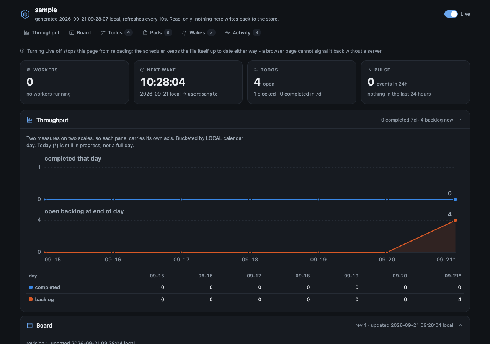

# Dashboard

hive can generate a read-only, self-contained HTML dashboard for each project. It opens directly from `file://`, so it does not need a web server and cannot write back to the store. The scheduler rewrites it on every tick when the rendered content changes.

## Enable it

Set `dashboard: true` in your project's committed `hive.yml`:

```yaml
dashboard: true
```

Run `hive init` to see where generated output lives. The dashboard is generated at `.hive/dashboard.html`. Add `.hive/` to `.gitignore`, but keep `hive.yml` committed.

## What it shows

The page starts with current status cards for workers, the next wake, todos, configured processes, and recent activity. Its detail sections show throughput, the board pad, open todos, configured processes when present, other pads, pending wakes, and recent activity.

The dashboard is read-only. It escapes displayed project data and includes no form that writes to hive.



## Opening and live updates

`hive` and `hive lead` open the dashboard in a browser at most once every eight hours. Pass `--no-dashboard` to skip that browser open for one invocation. If an older `.claude/dashboard/index.html` is still present, `hive doctor` reports it so you can remove it yourself.

The Live toggle controls a script timer that reloads the `file://` page every ten seconds. A timer can be stopped by the toggle, unlike a meta refresh scheduled while the page parses. Turning Live off stops the page reload, but it does not stop the scheduler from regenerating the file because a file page has no channel back to hive.
