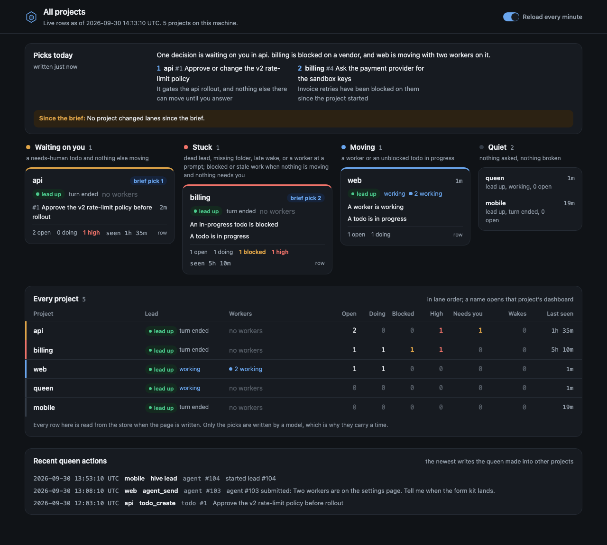

# The queen

The queen is one lead that watches every project you have registered, tells you which one needs you, and steers the others through their own leads. This page covers what it is, how to start it, what it may touch, and how to turn the thin profile hive ships into your own.

## What the queen is

Each project in hive has a lead, and that lead works one project. The queen is the lead of a special project, the queen home, which lives at `<data dir>/queen`. There is one queen per data dir.

It reads every registered project: pads, todos, workers, wakes. It does not do a project's work. When it finds something, it hands it to that project's lead as a todo, a comment, a message or a wake, and the lead decides what happens next.

A project is registered when you run `hive init` in it or start its lead there; see [Projects](projects.md#runbook-and-board-hive-init).

If you run one project, you do not need it. It earns its place when you have several projects, each with its own lead, and you want one place to ask "what needs me?"

## Start it

```bash
hive queen
```

The first run creates `<data dir>/queen`, writes a `hive.yml` there that selects the shipped `queen` profile, registers the directory as a project, writes its dashboard, and starts a lead in it. The default data dir is `~/.hive`, so the queen home is `~/.hive/queen` when `HIVE_DATA_DIR` is not set.

A second run finds the home already there and reattaches, or starts a fresh lead if the old one is gone. It never overwrites the `hive.yml`. If that file exists and does not select the `queen` profile, `hive queen` stops and tells you to fix it. It also refuses a path argument, a symlinked home, and a session locked to one project (`HIVE_PROJECT_LOCK=1`), so run it from your own terminal.

Pass `--no-dashboard` to skip opening the [queen dashboard](#the-queen-dashboard) for this run.

## What it can read and write

Reading is open. The queen reads any registered project by passing that project's `project_id` to `pad_read`, `todo_list`, `todo_get`, `agent_status` and the other read tools, and `hive portfolio` gives it one row per project. It never uses `project_select`, which hive refuses for it.

Writing into another project is narrow. The queen may do exactly these things there. Todos and comments land in that project's store for its lead to pick up, text and wakes go only to its running lead, and the queen never edits what the lead owns:

| Allowed | Detail |
|---|---|
| `todo_create`, `todo_comment` | Hand work or a question to the project |
| `wake_set`, `wake_when_idle` | Only with `deliver_to` set to that project's running lead, and never a standing `scope` watch |
| `wake_update`, `wake_cancel` | Only on a wake the queen set there, still addressed to the current lead |
| `agent_send` | Text only, to that project's running lead. `keys` is refused because it can interrupt a lead mid-turn |
| `hive lead <path>` | Starts or adopts that project's lead |
| `project_prune`, `hive project rm <id\|path>` | Removes a stray project. `project_prune` takes the empty-only sweep, or one `project_id` with `confirm_name` set to its exact name to remove a project that owns rows. Never the queen's own project, never one with a running agent. See [removing a project](projects.md#removing-a-project) |

Everything else there belongs to the project's own lead: pads, todo status, kv, leases, workers, project selection. `project_add` and `actor_prune` stay refused: they change the whole store, not one project. Anything not listed is refused with `QUEEN_CROSS_PROJECT_WRITE_REFUSED`, and the message names the operation, the project, and why. A tool hive has not classified for the queen is refused by default.

In its own home the queen is an ordinary project lead. Pads, todos and workers there are its own, and workers it spawns stay locked to the home.

Workers never get this reach. A spawned worker runs with `HIVE_PROJECT_LOCK=1`, and setting that variable in any session turns the queen's reach off entirely. Because the queen is identified by its running lead row in the queen home, another lead cannot borrow it either.

## The portfolio

```bash
hive portfolio          # one block per project
hive portfolio --json   # the same data as one object
```

It is deterministic and read-only. Each project lands in one of four lanes:

| Lane | Meaning |
|---|---|
| waiting on you | A todo is tagged `needs-human` and nothing else is moving |
| stuck | A hard stall, or stuck work on the todo graph when nothing is moving and nothing is tagged `needs-human` (the exact checks are below) |
| moving | A worker is working, or an in-progress todo is not blocked and has not gone stale |
| quiet | Nothing asked, nothing broken |

hive decides the lane in this order, and the first step that applies wins:

1. Stuck on a hard stall: the lead's pane is dead while a todo is in progress or a wake is pending; the project folder is missing while a todo is open or in progress or a wake is pending; a worker is waiting on input; or a wake is more than five minutes overdue.
2. Otherwise moving, if a worker is working or an in-progress todo is neither blocked nor stale.
3. Otherwise waiting on you, if a todo is tagged `needs-human`.
4. Otherwise stuck on the todo graph: an in-progress todo is blocked, every open or in-progress todo is blocked, or in-progress work has had no activity for 48 hours.
5. Otherwise quiet.

So a project with live work stays moving and keeps its `needs-human` count, and a dead lead pane makes a project stuck even when a worker is running. A pending wake never counts as movement, and a held wake is never overdue.

To put a project in front of yourself, tag a todo `needs-human`. A lead or worker sets it with `tags` on `todo_create` or `todo_update`; `todo_update` replaces the whole tag list, so include the tags the todo already has.

A sample with two invented projects:

```text
waiting_on_you api (#1)
  why: needs_human
  lead none; workers 0 working, 0 idle, 0 needs input, 0 other, 0 unreachable, 0 unconfirmed
  todos 2 open, 0 in progress, 0 blocked, 0 high; needs human 2; wakes 0 pending, 0 overdue
  last activity 2026-09-30 13:14:10 UTC
waiting_on_you web (#2)
  why: needs_human
  lead none; workers 0 working, 0 idle, 0 needs input, 0 other, 0 unreachable, 0 unconfirmed
  todos 1 open, 0 in progress, 0 blocked, 0 high; needs human 1; wakes 0 pending, 0 overdue
  last activity 2026-09-30 13:14:10 UTC

2 project(s): 2 waiting on you, 0 stuck, 0 moving, 0 quiet
```

## Jump to the project that needs you

```bash
hive next          # attach to that project's lead
hive next --print  # name the choice, start and attach nothing
```

`hive next` picks one project from the portfolio. Projects waiting on you come first, ranked by `needs-human` count, then oldest activity, then project id. Stuck projects come next, and so do moving projects holding a `needs-human` item, ranked by `needs-human` count, then blocked in-progress todos, overdue wakes, workers needing input, oldest activity, then project id. It skips the queen home.

`--print` prints the choice as one JSON line and exits, so you can check the ranking without moving your terminal:

```text
{"project_id":1,"name":"api","root":"/home/you/code/api","lane":"waiting_on_you","reasons":["needs_human"],"lead_state":"none"}
```

With nothing to pick, it prints this line and exits 0:

```text
No project needs you: none is waiting, stuck, or holding a needs-human item.
```

Without `--print`, it starts that project's lead detached first, then attaches. A dead or reissued lead is restarted, and a live one is adopted. If hive cannot tell whether the lead is alive because tmux did not answer, it starts nothing. It exits 1 when the chosen project's folder is missing, and it refuses in a session locked to one project.

## Start a lead without attaching

```bash
hive lead ~/Code/web --detach
```

`--detach` starts the project's lead, or adopts a live one, and prints its pane and an attach command instead of attaching:

```text
LEAD_PANE=<pane id>
ATTACH_COMMAND=hive attach '<project path>'
```

The queen uses this to spin up a lead in a project that has none. From a script or a queen pane (stdin or stdout is not a terminal) it also has a trust rule. If the project's `hive.yml` has a `lead` command, or an auto-starting process, that you have not approved, `--detach` stops with `hive lead: "<name>" is not trusted; run hive lead <path> interactively once` and exits 1. Run `hive lead <path>` once in your own terminal, approve the commands, and detached starts work after that. Untrusted commands never run.

## The queen dashboard

The queen has its own dashboard, separate from the [per-project dashboard](dashboard.md). It lives at `<data dir>/queen/dashboard.html` and opens straight from `file://`. It is read-only.



`hive queen` writes it once at start, and the scheduler rewrites it when the content changes. On macOS `hive queen` opens it in your browser, and it opens at most once per interval, the same throttle a project dashboard uses. `--no-dashboard` skips the open.

The page is titled "All projects". It shows:

- A "Picks today" card from the queen's brief, with a "Since the brief" line naming projects that changed lane after it was written.
- One section per lane, in the order waiting on you, stuck, moving, quiet. Active projects are cards with their reasons, lead state and workers; quiet ones are a short list. A project name opens that project's own dashboard when it has one.
- An "Every project" grid with one row per project.
- A "Recent queen actions" card from the audit trail.

The brief is the one piece of content the queen writes for the page. It is a JSON value in the queen home's kv under the key `queen:brief`, written with `kv_set`. The page reads it and shows "No queen brief yet." when the key is missing, and a plain error line when the value does not parse:

```json
{
  "schema_version": 1,
  "written_at": "2026-09-30 09:00:00",
  "summary": "Two projects need a decision; nothing is on fire.",
  "picks": [
    { "project_id": 1, "todo_id": 1, "action": "Decide the pagination style", "reason": "It blocks the list endpoints" }
  ],
  "lanes_at_brief": { "1": "waiting_on_you", "2": "waiting_on_you" }
}
```

Those five keys are the whole shape: no extras are allowed, `written_at` is a UTC `YYYY-MM-DD HH:MM:SS` string, `todo_id` may be `null`, and `lanes_at_brief` maps project ids to lane names. Each pick has exactly `project_id`, `todo_id`, `action` and `reason`; `summary`, `action` and `reason` cannot be blank; `written_at` uses a space, not a `T`; and the value is a JSON object, not a JSON-encoded string. A brief older than 24 hours is marked stale. hive ships no schedule for writing one. What the queen writes, and when, is your profile's business (see [Make it yours](#make-it-yours)).

## Know when a lead ends a turn

The queen can ask to be woken when another project's lead ends a turn:

```text
wake_when_idle(lead_project_id=<project id>, body="...", mode="any", max_wait_seconds=...)
```

`lead_project_id` belongs to the queen alone. Any other caller gets `LEAD_WATCH_QUEEN_ONLY`. The wake is stored in the queen's own project and delivered to the queen's pane, so `project_id` and `deliver_to` are refused with it. The project must have a running lead, and it cannot be the queen home.

With `mode="any"` it fires on the lead's next turn ending; a turn that had already ended does not count. With `mode="all"` it fires once the lead's turn has ended; if the turn has already ended, the call returns `already_satisfied` and schedules nothing. `max_wait_seconds` defaults to 900. If the lead's pane holds a dialog or unsubmitted text, the wake waits rather than pasting into it.

A turn ending is not the lead finishing its work. Read what the lead did before you act on the wake.

The watch ends with a named reason instead of firing when the lead goes away:

| Reason | Meaning |
|---|---|
| `LEAD_TARGET_GONE` | The lead is no longer running, or its pane is gone |
| `LEAD_TARGET_RESTARTED` | A new lead session replaced the one being watched |
| `LEAD_TARGET_REISSUED` | The pane id now belongs to a different process |

`wake_get` and `wake_list` show a `lead_watch` object for these wakes, with a `terminal_reason` once one applies.

## The audit trail

```bash
hive queen-audit                     # newest first, default 20
hive queen-audit --limit 100 --json  # up to 100 rows as one JSON object
hive queen-audit --project-id 1      # the queen's pane only, see below
```

Run it from a terminal inside a registered project and it lists the queen writes into that project. Outside a registered project it prints `hive queen-audit: the cwd is not a registered project. Run this command from a registered project.` and exits 1. `--project-id` for another project belongs to the queen alone; anyone else gets `Queen audit access is limited to your own project` and exit 1.

The store-wide view is the queen's own `queen_audit_list` tool, which returns the same rows for any target, and the "Recent queen actions" card on the queen dashboard. Every confirmed queen write into another project is recorded: `todo_create`, `todo_comment`, `wake_set`, `wake_when_idle`, `wake_update`, `wake_cancel`, `agent_send`, `hive lead`, `project_prune` and `hive project rm`, each with the target project, the resource, and a summary of at most 160 characters.

Rows are kept for 30 days, with a 20,000-row backstop, and the maximum per call is 100.

One gap is stated on purpose. A crash after a terminal send but before its audit insert can leave that send unrecorded.

With no rows yet, the command prints:

```text
No queen actions recorded.
```

## Make it yours

The shipped `queen` profile is a skeleton on purpose. Its posture tells the queen what it may touch and how to label ids. Its runbook is headers and angle-bracket slots, because how you want a portfolio run is yours to say. Fork the runbook and fill the slots in:

```bash
hive profile fork queen runbook.md
```

That copies the file to `<data dir>/profiles/queen/` and it stays yours; the files you never forked keep tracking hive's defaults. Replace each `<...>` slot: what you bring to the queen, when it should start a lead, and what it should do on a schedule. A schedule is built from `wake_set` on the queen's own pane, so a morning check-in looks like a wake you set once from the runbook:

```text
wake_set(delay_seconds=..., repeat_every_seconds=86400, body="Read hive portfolio and write the brief")
```

That line is an example of what you can build, not something hive sets up for you. hive ships no schedule, no brief-writing routine, and no priority pad.

To have the queen speak first, set `first_message` in `<data dir>/queen/hive.yml`. hive ships no default text, so without it the queen waits for you. See [Configuration](configuration.md) for the key and [Projects](projects.md) for the `hive.yml` format.

```yaml
profile: queen
first_message: "Read hive portfolio and tell me which project needs me first."
```

Add `vars:` to the same file to fill `{{name}}` slots in your forked runbook.

## Limits

- One machine. The store is a local SQLite file and nothing syncs, so the queen sees the projects registered in this data dir and no others.
- A lead must be running to be typed into. `agent_send` and lead-addressed wakes need that project's lead alive; start one with `hive lead <path> --detach` first.
- After an upgrade, restart every hive session, the queen's included. A running lead keeps the code it started with.
